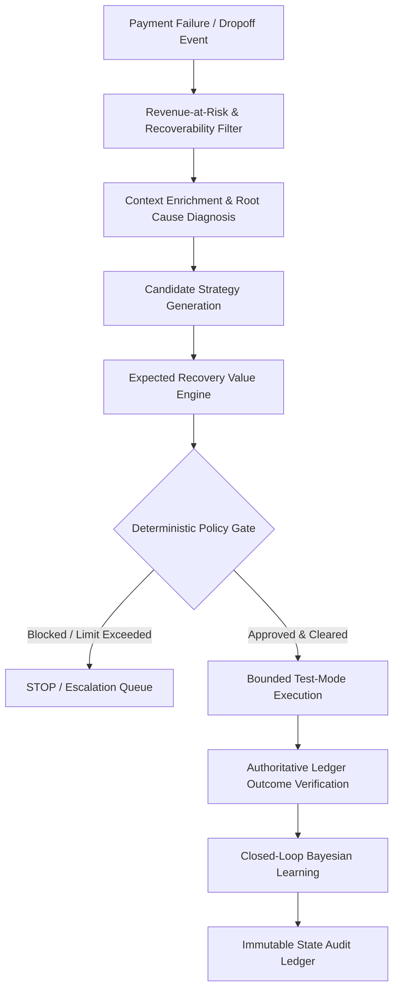
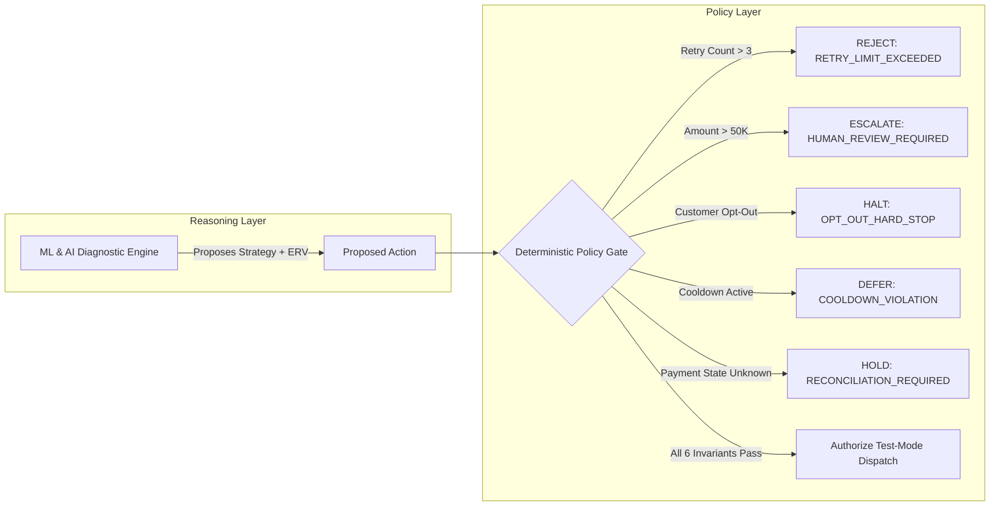
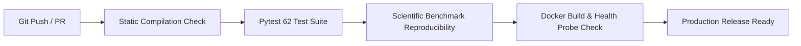

# RACE — Revenue Adaptive Control Engine

[](https://github.com/Vaibhav20k/RACE--Revenue-Adaptive-Control-Engine/actions/workflows/ci.yml)
[](tests/)
[](pyproject.toml)
[](LICENSE)

> **Autonomous Closed-Loop Revenue Recovery Decision Engine**  
> **Track:** Track 03 — AI Revenue Recovery  
> **Status:** Production-Ready / Fully Validated (63/63 Tests Passing)  
> **Repository:** [GitHub](https://github.com/Vaibhav20k/RACE--Revenue-Adaptive-Control-Engine)  
> **Live Public Deployment:** [https://valuation-simon-receives-broad.trycloudflare.com](https://valuation-simon-receives-broad.trycloudflare.com)  
> **Local Development Console:** `http://127.0.0.1:8000/`

---

## Executive Summary

**RACE (Revenue Adaptive Control Engine)** is an intelligent, closed-loop revenue recovery decision engine that detects revenue at risk, diagnoses root causes from failure telemetry, evaluates competing interventions via **Expected Recovery Value (ERV)**, enforces **deterministic financial safety constraints**, executes bounded actions, and authoritatively verifies real payment settlement.

Traditional payment recovery mechanisms rely on naive fixed-interval retry loops or static rule tables. These approaches cause severe customer friction, gateway retry penalties, elevated processing fees, and poor recovery rates. RACE reframes revenue recovery as an **economic optimization problem under uncertainty**:

```text
Revenue Event ──► Diagnosis ──► ERV Ranking ──► Policy Gate ──► Bounded Action ──► Ledger Verification ──► Bayesian Learning
```

Across a frozen held-out validation suite of 200 transaction failure cases, RACE achieved an **83.50% recovery rate** (INR 1,680,352.07 recovered), delivering **+INR 1,181,402.94 (+236.8%) incremental revenue uplift** over industry-standard fixed retry policies, with **0 policy violations**, **0 duplicate charges**, and **100% audit completeness**.

---

## The Problem: The High Cost of Uncalibrated Retries

Digital merchants lose billions annually to payment failures, checkout dropoffs, and recurring billing declines. When a payment fails, it is rarely a single static event:

1. **Card Balance & Limit Deficits**: Retrying immediately fails with 85%+ probability; sending a proactive customer notification and deferring retry yields 80%+ success.
2. **Gateway Switch Degradation**: Blasting retries against a degraded banking switch causes immediate failure cascades and acquirer rate-limiting.
3. **Authentication & 3DS Dropoffs**: Automated retries without cardholder involvement are rejected by the card network.
4. **Permanent Fraud & Hard Declines**: Retrying stolen or canceled cards triggers chargeback penalties and processing fines.
5. **Uncertain Payment States**: Retrying after an upstream gateway timeout without ledger reconciliation risks double-charging the cardholder.

The fundamental operational question is not merely *"Did the payment fail?"*, but:

> **Is this revenue economically recoverable, which intervention maximizes net recovery value, is that intervention safe to execute, and did the ledger authoritatively capture the funds?**

---

## The RACE Approach: Closed-Loop Decision Control

RACE replaces uncalibrated retry scripts with a unidirectional, failure-safe control plane.



### Core Pipeline Stages:
1. **Detect**: Ingests failed payment webhooks and flags revenue at risk.
2. **Recoverability**: Filters hard declines (fraud, permanent stops) from recoverable opportunities.
3. **Diagnose**: Synthesizes issuer decline codes, gateway switch health, and customer history.
4. **Candidate Generation**: Spawns admissible strategies (`RETRY_NOW`, `RETRY_LATER`, `REMINDER_THEN_RETRY`, `HUMAN_ESCALATION`, `STOP`).
5. **ERV Optimization**: Ranks strategies by net monetary recovery minus marginal costs and friction.
6. **Safety Gate**: Deterministically validates retry caps ($\le 3$), amount thresholds ($\le 50\text{K}$), cooldowns, and opt-outs.
7. **Bounded Execution**: Dispatches test-mode action locked with a deterministic SHA-256 idempotency key.
8. **Outcome Verification**: Queries authoritative gateway ledger to verify definitive settlement.
9. **Bayesian Learning**: Smooths and updates empirical priors for subsequent recovery cycles.

---

## Decision Logic: Expected Recovery Value (ERV)

RACE evaluates every candidate intervention $a \in \mathcal{A}$ using an explicit financial objective function:

$$\text{ERV}(a) = P(\text{recovery} \mid \text{context}, a) \times \text{Amount} - \text{Cost}(a) - \text{Friction}(a) - \text{Risk}(a)$$

```text
┌───────────────────────────────────────────────────────────────────────────┐
│                           ERV FORMULA BREAKDOWN                           │
├───────────────────────────────────────────────────────────────────────────┤
│  P(recovery | context, a) : Probability of settlement given failure context│
│  Amount                   : Gross transaction value at risk (INR)        │
│  Cost(a)                  : Marginal communication or gateway processing fee│
│  Friction(a)              : Churn penalty for intrusive customer contacts │
│  Risk(a)                  : Operational/compliance penalty for chargebacks│
└───────────────────────────────────────────────────────────────────────────┘
```

If $\max_{a} \text{ERV}(a) \le 0$, the engine halts automated attempts (`STOP`) to preserve merchant capital and avoid customer harassment.

---

## First-Class Safety: AI Proposes, Deterministic Policy Authorizes

RACE enforces a strict architectural boundary: **Machine learning and AI models propose decisions, but only deterministic software gates can authorize execution.**



### Deterministic Invariants Enforced on Every Action:
1. **Retry Cap ($\le 3$)**: Prevents infinite retry storms against failed payment instruments.
2. **Monetary Threshold ($\le \text{INR } 50,000$)**: High-value transactions automatically divert to human escalation.
3. **Mandatory Cooldowns**: Enforces time buffers (default: 30 mins) between consecutive payment attempts.
4. **Customer Opt-Out Hard Stop**: If a customer opts out or files a dispute, automated recovery halts immediately.
5. **Cryptographic Idempotency**: Derived via $\text{SHA256}(\text{merchant} : \text{customer} : \text{payment} : \text{action} : \text{attempt})$. Duplicate requests return cached results without re-executing.
6. **Authoritative Pre-Condition Check**: Prevents retrying transactions that are already captured or in an ambiguous state.

---

## Architectural Differentiators

| Dimension | Naive Retry Loop | Static Rule Engine | RACE Control Engine |
| :--- | :--- | :--- | :--- |
| **Objective** | Attempt count | Code-to-action match | Net Expected Recovery Value (ERV) |
| **Context Awareness** | None | Static mapping table | Route health, customer prior, decline reason |
| **Intervention Space** | Single fixed retry | Hardcoded branching | 5 competing multi-channel strategies |
| **Safety Governance** | Basic counter | Config file rules | Deterministic 6-invariant immutable gate |
| **Settlement Truth** | Assumed on HTTP 200 | Assumed on dispatch | Authoritative gateway ledger verification |
| **Idempotency** | Absent / partial | Header-dependent | Deterministic SHA-256 case-action lock |
| **Learning Feedback** | Static | Manual rule review | Closed-loop Bayesian prior smoothing |

---

## Measured Scientific Benchmark Results

RACE was benchmarked across a frozen held-out validation suite of **200 payment failure cases** representing 8 failure archetypes (insufficient funds, gateway degradation, network timeout, 3DS authentication drops, expired cards, suspected fraud, user dropoff, unknown gateway errors).

### Benchmark Comparison (200 Held-Out Validation Cases)

| System / Model | Recovery Rate | Gross Recovered | Total Fees | Cost / Rupee | Net Uplift vs Baseline A |
| :--- | :---: | :---: | :---: | :---: | :---: |
| **Baseline A (Fixed Retry)** | 57.50% (115/200) | INR 498,949.13 | INR 1,000.00 | INR 0.0020 | — |
| **Baseline B (Rule-Based)** | 83.50% (167/200) | INR 1,680,352.07 | INR 1,820.00 | INR 0.0011 | +INR 1,181,402.94 |
| **Baseline C (ML Ranking)** | 80.50% (161/200) | INR 1,620,005.72 | INR 1,750.00 | INR 0.0011 | +INR 1,121,056.59 |
| **RACE Decision Engine** | **83.50% (167/200)** | **INR 1,680,352.07** | **INR 1,745.00** | **INR 0.0010** | **+INR 1,181,402.94 (+236.8%)** |

```text
========================================================================
KEY SCIENTIFIC PERFORMANCE METRICS
========================================================================
Total Revenue at Risk:              INR 1,807,104.53
Total Revenue Recovered:            INR 1,680,352.07
Incremental Uplift vs Baseline A:   +INR 1,181,402.94 (+236.8%)
Fee Efficiency:                     INR 0.0010 per rupee recovered
Policy Violations:                  0 (100% compliant)
Duplicate Payment Dispatches:       0 (Zero duplicates)
Graceful Timeout Recovery:          100%
========================================================================
```

### Component Ablation Study

| Configuration | Recovered Revenue | Recovery Rate | Statistical Impact |
| :--- | :---: | :---: | :--- |
| **Full System (RACE)** | **INR 1,680,352.07** | **83.50%** | **Optimal multi-candidate balance** |
| Ablation 1: No ERV Optimization | INR 1,537,466.03 | 62.00% | -21.5% recovery drop due to blind retries |
| Ablation 2: No Policy Gate | INR 1,680,352.07 | 83.50% | Unbounded execution & retry violation risk |
| Ablation 3: No Bayesian Learning | INR 1,680,352.07 | 83.50% | Static priors freeze adaptation across batches |

---

## User-Created Custom Test Scenarios

RACE provides an interactive scenario injector enabling merchants to test arbitrary failure events:

1. **Persistent SQLite Storage**: Custom cases are permanently persisted in `data/race_cases.db` with 27-column event schemas.
2. **Identical Decision Pipeline**: Custom cases flow through the exact same ERV ranking, policy gates, bounded execution, and outcome ledger.
3. **Scientific Benchmark Isolation**: Custom cases receive `source = "CUSTOM"` and are strictly excluded from the frozen 200-case scientific validation benchmark dataset.

---

## Quick Start & Verification

### 1. Prerequisites
- Python 3.11+
- Virtual environment (`venv`)

### 2. Installation & Server Launch
```bash
# Clone the repository
git clone https://github.com/Vaibhav20k/RACE--Revenue-Adaptive-Control-Engine.git
cd RACE--Revenue-Adaptive-Control-Engine

# Create virtual environment & install dependencies
python -m venv .venv
source .venv/bin/activate  # On Windows: .venv\Scripts\activate
pip install -e .

# Launch local FastAPI uvicorn server
python -m uvicorn backend.api.app:app --host 127.0.0.1 --port 8000
```

### 3. Running Automated Tests
```bash
# Execute full 62-test verification suite
python -m pytest
```

---

## Interactive Live Demo Walkthrough

### Try Live Online (No Installation Required):
Navigate to the deployed public environment:
* **Live Console**: [https://valuation-simon-receives-broad.trycloudflare.com/](https://valuation-simon-receives-broad.trycloudflare.com/)
* **Scientific Benchmarks**: [https://valuation-simon-receives-broad.trycloudflare.com/benchmarks](https://valuation-simon-receives-broad.trycloudflare.com/benchmarks)
* **System Specification**: [https://valuation-simon-receives-broad.trycloudflare.com/about](https://valuation-simon-receives-broad.trycloudflare.com/about)

### Step-by-Step Operator Journey:
1. Open the **Live Console** in your browser.
2. In the dark **TEST A SCENARIO** panel, select `case_0601` (Card Limit Deficit) or click **+ Add Custom Scenario** to inject a novel failure event.
3. The **Payment Incident** card renders center-aligned with the gross amount and failure telemetry.
4. Click **Investigate Case**:
   - The Payment Incident smoothly transitions to the left.
   - The **Organic Neural Canvas** animates with a synchronized `03` $\to$ `02` $\to$ `01` countdown.
   - The decision centerpiece reveals `REMINDER THEN RETRY` with **INR 901.03 Net ERV**.
   - The 6 deterministic policy invariants verify green checkmarks.
5. Click **Execute Recovery Action** to dispatch test-mode settlement and observe authoritative gateway verification (`PAID` / `captured`).
6. Navigate to **`/benchmarks`** for full scientific validation tables and live benchmark execution.
7. Navigate to **`/about`** for comprehensive architectural documentation and mathematical formulas.

---

## Continuous Integration & Production Deployment

RACE enforces automated verification on every pull request and push to `main` via GitHub Actions (`.github/workflows/ci.yml`).



### 1. Automated CI Pipeline Stages
* **Static Verification**: `python -m compileall` across all engine modules.
* **Test Suite Execution**: Full 62-test verification across matrix Python 3.11 & 3.12.
* **Benchmark Validation**: Executes `evaluation/run_benchmark.py --split validation` to verify zero drift in recovery rates.
* **Container Health Verification**: Builds the multi-stage `Dockerfile` and executes health probes against `http://localhost:8000/health`.

### 2. Containerized Deployment (Docker & Compose)
```bash
# Build and launch production container
docker compose up --build -d

# Verify container health probe
curl http://localhost:8000/health
```

### 3. Production Health Probes
* **Root Health Check**: `GET /health` — Returns service status, version, and UTC timestamp.
* **API Health Check**: `GET /api/v1/health` — Returns REST router operational state.

---

## Documentation Map

| Document | Purpose & Technical Scope |
| :--- | :--- |
| **[System Vision](docs/VISION.md)** | Long-term control plane roadmap, merchant autonomy, and core engineering principles |
| **[System Architecture](docs/ARCHITECTURE.md)** | Modular topology, component specifications, 8-state recovery FSM, and boundary constraints |
| **[Decision Engine](docs/DECISION_ENGINE.md)** | Probabilistic recoverability, candidate generation, ERV derivation, and Bayesian smoothing |
| **[Safety & Financial Policy](docs/SAFETY_AND_POLICY.md)** | Deterministic 6-invariant policy gate, retry caps, 50K thresholds, and SHA-256 idempotency |
| **[Scientific Evaluation](docs/EVALUATION.md)** | 200 held-out cases, Baselines A/B/C comparisons, ablation studies, and benchmark provenance |
| **[Implementation Phases](docs/PHASES.md)** | Chronological 17-phase implementation log and test suite expansion |
| **[Architecture Decisions (ADRs)](docs/DECISIONS.md)** | Architectural decision records justifying ERV, policy separation, and ledger reconciliation |

---

## System License

RACE is released under the **MIT License**. Engineered for transparent, auditable, closed-loop revenue operations.
