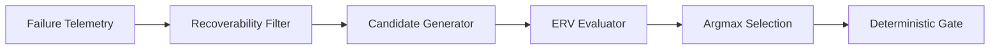

# RACE Decision Engine Specification

## 1. Decision Philosophy

In traditional payment systems, recovery actions are dispatched via static heuristics: if a payment fails, retry immediately or after a fixed interval. This ignores:
1. **Economic Viability**: An action costing INR 50 in SMS/manual overhead on an INR 30 transaction produces negative net business value.
2. **Contextual Degradation**: Retrying when a bank switch is DOWN yields near-zero success probability and wastes retry budgets.
3. **Customer Relationship Impact**: Repeated failed automated debit attempts erode cardholder trust and risk chargebacks.

RACE models revenue recovery as a **stochastic economic optimization problem**. Every candidate intervention is evaluated against its **Expected Recovery Value (ERV)**.

---

## 2. Decision Pipeline Stages

### 2.1 Recoverability Estimation
Before generating expensive intervention candidates, the engine assesses whether the failure event represents a viable recovery opportunity:
* **Unrecoverable Cases**: Suspected fraud (`FRAUD_SUSPECTED`), permanent card expiry (`EXPIRED_CARD`), or explicit customer opt-outs are immediately routed to `STOP`.
* **Recoverable Opportunities**: Insufficient funds, temporary route degradations, network timeouts, and authentication dropoffs proceed to strategy generation.

### 2.2 Context Synthesis & Diagnosis
The engine constructs a rich context vector incorporating:
* **Issuer Response Code**: Exact reason code (e.g. `INSUFFICIENT_FUNDS_OR_LIMIT`, `ISSUER_SWITCH_DEGRADED`).
* **Gateway Switch Health**: Real-time route state (`UP`, `DEGRADED`, `DOWN`).
* **Customer Historical Reliability**: Prior recovery completion rate ($r_{\text{cust}} \in [0.0, 1.0]$).
* **Payment Instrument**: Rail type (`CARD`, `UPI`, `NETBANKING`, `WALLET`).

---

## 3. Candidate Strategy Space

RACE implements 5 distinct recovery actions tailored to specific failure dynamics:

| Strategy | Ideal Use Case | Communication Cost | Friction Penalty | Downside Risk |
| :--- | :--- | :---: | :---: | :---: |
| `RETRY_NOW` | Network timeouts on healthy routes | INR 5.00 | INR 5.00 | INR 5.00 |
| `RETRY_LATER` | Temporary gateway switch degradation | INR 5.00 | INR 5.00 | INR 5.00 |
| `REMINDER_THEN_RETRY` | Insufficient funds / 3DS dropoffs | INR 8.00 | INR 15.00 | INR 5.00 |
| `HUMAN_ESCALATION` | High-value transactions ($\ge 50\text{K}$) | INR 50.00 | INR 20.00 | INR 10.00 |
| `STOP` | Fraud, opt-out, or negative ERV | INR 0.00 | INR 0.00 | INR 0.00 |

---

## 4. Expected Recovery Value (ERV) Mathematical Formulation

For each admissible action $a \in \mathcal{A}$, the engine evaluates:

$$\text{ERV}(a) = P(\text{recovery} \mid \mathbf{x}, a) \times \text{Amount} - \text{Cost}(a) - \text{Friction}(a) - \text{Risk}(a)$$

### Parameter Definitions:
1. **$P(\text{recovery} \mid \mathbf{x}, a)$**: The conditional probability of payment capture given context vector $\mathbf{x}$ and candidate action $a$. Calculated from historical feature models and calibrated empirical priors.
2. **$\text{Amount}$**: Gross transaction value in INR.
3. **$\text{Cost}(a)$**: Direct out-of-pocket marginal cost (gateway API retry fees, SMS/WhatsApp dispatch fees, agent time).
4. **$\text{Friction}(a)$**: Monetary penalty quantifying cardholder annoyance and churn hazard from intrusive notifications.
5. **$\text{Risk}(a)$**: Penalty for dispute, chargeback, or acquirer rate-limiting risk.

### Optimal Action Selection:
$$a^* = \arg\max_{a \in \mathcal{A}} \text{ERV}(a)$$

$$\text{Final Action} = \begin{cases} a^* & \text{if } \text{ERV}(a^*) > 0 \\ \text{STOP} & \text{if } \text{ERV}(a^*) \le 0 \end{cases}$$

---

## 5. Closed-Loop Bayesian Learning

RACE continuously refines its recovery estimates using observed settlement outcomes. When an action $a$ is executed for failure archetype $f$, the empirical success store is updated:

$$P_{\text{smoothed}}(f, a) = \frac{k_{f, a} + (\pi_{f, a} \times w)}{n_{f, a} + w}$$

Where:
* $k_{f, a}$ = Total successful payment captures observed for pair $(f, a)$.
* $n_{f, a}$ = Total execution attempts observed for pair $(f, a)$.
* $\pi_{f, a}$ = Prior recovery baseline rate.
* $w$ = Pseudo-count Bayesian smoothing weight ($w = 3.0$).

This prevents small-sample overfitting while allowing the engine to rapidly adapt to real-time issuer switch recovery patterns.
