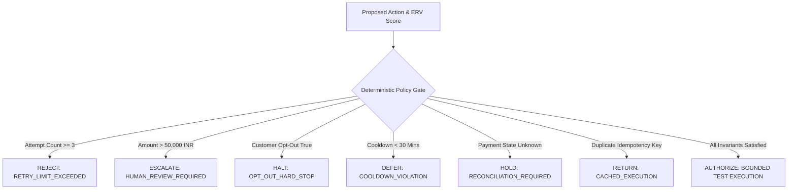

# RACE Safety & Financial Policy Specification

## 1. Safety Architecture: Deterministic Policy Governance

RACE enforces a strict invariant: **AI and statistical models are advisory; only deterministic software controls possess execution authority.**

---

## 2. Mandatory Deterministic Invariants

### 2.1 Maximum Automated Retry Limit
* **Rule**: Maximum of **3 automated attempts** per recovery lifecycle.
* **Enforcement**: When `retry_count >= 3`, all automated payment actions are rejected. The case transitions to `STOPPED` or triggers manual escalation.
* **Rationale**: Prevents infinite retry loops that incur acquirer penalties and card network fines.

### 2.2 Monetary Automation Threshold
* **Rule**: Maximum automated transaction value of **INR 50,000.00**.
* **Enforcement**: Any case where `amount > 50,000.00` is immediately redirected to `HUMAN_ESCALATION`.
* **Rationale**: Protects merchants from catastrophic programmatic loss on enterprise-tier transactions.

### 2.3 Mandatory Cooldown Buffers
* **Rule**: Minimum time interval between successive payment actions on the same customer/order is **30 minutes**.
* **Enforcement**: Requests initiated within the cooldown window are rejected with `COOLDOWN_VIOLATION`.
* **Rationale**: Allows downstream banking switches and customer accounts sufficient time to refresh balances.

### 2.4 Customer Opt-Out Hard Stop
* **Rule**: If `customer_opted_out == True` or a chargeback dispute is open, automated actions are immediately blocked.
* **Enforcement**: Case transitions directly to `STOPPED`.
* **Rationale**: Ensures compliance with consumer protection mandates and prevents customer churn.

### 2.5 Cryptographic Idempotency Enforcement
* **Rule**: Every execution requires a deterministic SHA-256 idempotency key:
  $$\text{Key} = \text{SHA256}(\text{merchant\_id} : \text{customer\_id} : \text{payment\_id} : \text{action} : \text{attempt})$$
* **Enforcement**: The idempotency ledger checks for duplicate keys. If a duplicate is detected, the cached result is returned without re-executing.
* **Rationale**: Completely eliminates double-debit hazards during upstream network timeouts.

### 2.6 Authoritative State Pre-Conditions & Unknown State Handling
* **Rule**: Actions can only execute against transactions whose gateway state is definitively `FAILED` or `PENDING_RETRY`.
* **Enforcement**: If a payment is already `PAID`/`captured`, the action is cancelled. If the state is `UNKNOWN` (e.g. timeout during charge), retries are blocked until the state is reconciled with the gateway ledger.
* **Rationale**: Prevents recharging cards when a previous transaction succeeded silently.

---

## 3. Stopping Rules Matrix

The engine transitions a case to `STOPPED` under any of the following conditions:

| Condition | Trigger | Resulting State |
| :--- | :--- | :--- |
| **Max Retries Exceeded** | `retry_count >= 3` | `STOPPED` |
| **Negative Economic Value** | $\max_{a} \text{ERV}(a) \le 0$ | `STOPPED` |
| **Customer Opt-Out** | `customer_opted_out == True` | `STOPPED` |
| **Recovery Window Expired** | `time_since_failure > 72h` | `STOPPED` |
| **Permanent Failure Code** | `FRAUD_SUSPECTED` / `EXPIRED_CARD` | `STOPPED` |

---

## 4. Immutable Audit Ledger

Every policy decision, invariant evaluation, and state transition is committed to the append-only `AuditLedger`:
* **Logged Metadata**: `case_id`, `from_state`, `to_state`, `selected_action`, `policy_decision`, `idempotency_key`, `erv_breakdown`, `timestamp`.
* **Compliance Guarantee**: 100% of decisions are reproducible and verifiable for merchant accounting audits.
