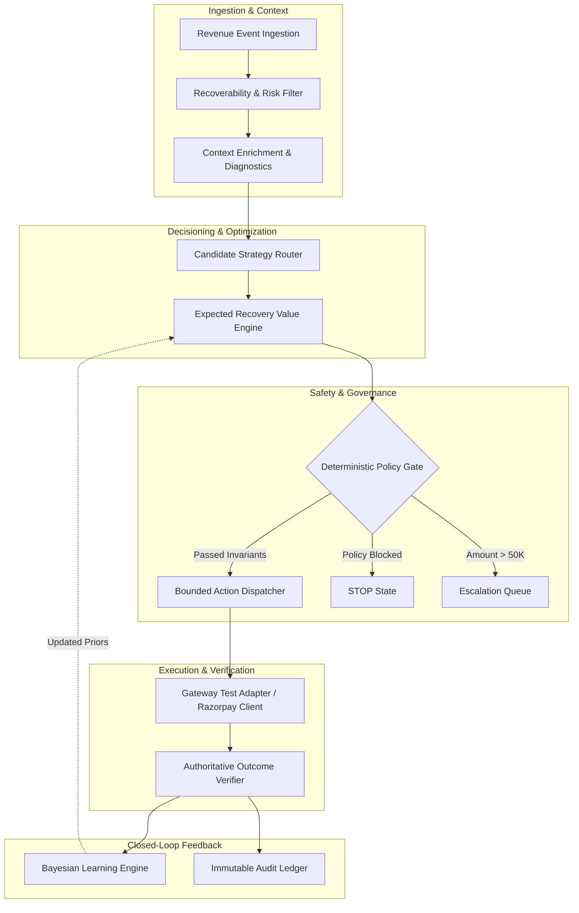
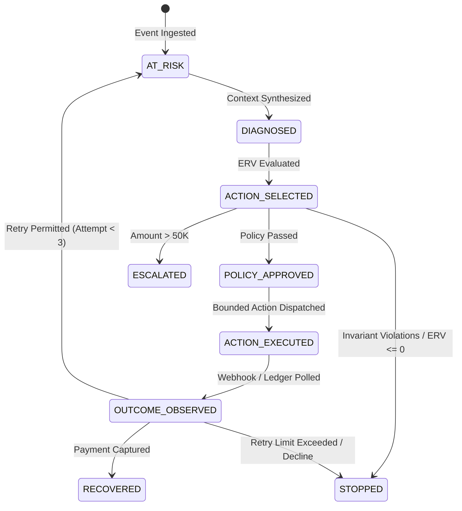

# RACE System Architecture Specification

## 1. Architectural Topology

RACE is organized into modular, decoupled layers with strict separation between statistical inference, diagnostic reasoning, deterministic safety gates, execution adapters, and authoritative outcome verification.

---

## 2. Core Subsystems & Components

### 2.1 Event Ingestion & Feature Extraction
* **Module**: `backend/domain/events.py`, `backend/ml/features.py`
* **Function**: Ingests structured `RevenueEvent` payloads validating 27 transaction fields (amount, currency, failure class, decline code, route health, customer history, retry attempt counter, merchant tier).
* **Feature Pipeline**: Encodes categorical variables (payment method, route health, failure class) and scales numeric attributes (amount, customer history rate, time since failure).

### 2.2 Strategy Router & Candidate Generator
* **Module**: `backend/recovery/router.py`
* **Function**: Evaluates failure classes and admissible recovery actions:
  * `RETRY_NOW`: For transient network blips on healthy routes.
  * `RETRY_LATER`: For temporary route degradations requiring switch recovery cooldown.
  * `REMINDER_THEN_RETRY`: For insufficient card balance or user authentication dropoffs.
  * `HUMAN_ESCALATION`: For high-value transactions ($\ge \text{INR } 50,000$).
  * `STOP`: For fraud suspects, customer opt-outs, or negative ERV cases.

### 2.3 Expected Recovery Value (ERV) Engine
* **Module**: `backend/core/economics.py`
* **Function**: Computes net monetary value for each admissible action:
  $$\text{ERV}(a) = P(\text{recovery} \mid \text{context}, a) \times \text{Amount} - \text{Cost}(a) - \text{Friction}(a) - \text{Risk}(a)$$
* **Objective**: Selects $a^* = \arg\max_{a} \text{ERV}(a)$. If $\max \text{ERV} \le 0$, automatically falls back to `STOP`.

### 2.4 Deterministic Policy Gate
* **Module**: `backend/policy/gate.py`
* **Function**: Enforces 6 mandatory invariants before permitting execution:
  1. `retry_count < 3`
  2. `amount <= 50,000.00`
  3. `cooldown_period >= 30 minutes`
  4. `customer_opted_out == False`
  5. `payment_state == FAILED` (rejects `PAID` or `UNKNOWN`)
  6. `idempotency_key` uniqueness

### 2.5 Bounded Execution Adapter
* **Module**: `backend/recovery/executor.py`, `backend/integrations/razorpay/client.py`
* **Function**: Dispatches bounded test-mode actions (payment retries, payment link creations) with SHA-256 idempotency locks. Handles upstream timeouts without duplicating state.

### 2.6 Outcome Verification & Audit Ledger
* **Module**: `backend/recovery/verification/verifier.py`, `backend/recovery/audit/ledger.py`
* **Function**: Queries authoritative payment state from the gateway ledger (`captured`/`paid`). Emits immutable audit entries tracking state transitions, idempotency keys, and recovered rupees.

### 2.7 Closed-Loop Bayesian Learning
* **Module**: `backend/recovery/learning/statistics_store.py`, `backend/recovery/learning/engine.py`
* **Function**: Updates empirical recovery rate distributions using Bayesian pseudo-count smoothing ($w = 3.0$):
  $$P_{\text{smoothed}} = \frac{\text{SuccessCount} + (\text{PriorRate} \times w)}{\text{SampleCount} + w}$$

---

## 3. The 8-State Recovery Finite State Machine (FSM)

---

## 4. Storage & Persistence Architecture

* **Frozen Benchmark Datasets**: Static validation splits located in `datasets/validation/` containing 200 held-out cases with fixed ground truth counterfactuals.
* **Custom Cases SQLite Database**: Located at `data/race_cases.db`, persists merchant-injected test scenarios across restarts with full schema integrity.
* **In-Memory Caches**: Caches active execution sessions and state transition history for sub-millisecond console exploration.
