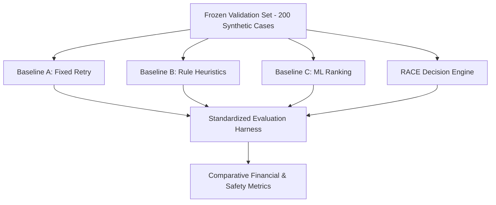

# RACE Scientific Evaluation & Benchmark Specification

## 1. Evaluation Methodology & Scientific Protocol

RACE is evaluated under a strict scientific protocol designed to ensure reproducibility and honest financial accounting:
1. **Frozen Validation Split**: Evaluated across 200 held-out synthetic validation cases (`datasets/validation/`) spanning 8 distinct payment failure archetypes with pre-computed counterfactual outcomes.
2. **Dual Metrics**: Both **Transaction-Count Recovery Rate** (recovered cases / total cases) and **Revenue-Weighted Recovery Rate** (recovered gross revenue / total revenue at risk) are reported.
3. **Fixed Dispatch Budgets**: All comparative models operate under identical execution budget constraints (maximum 3 attempts, fixed fee schedules).
4. **Net Financial Accounting**: Evaluated as Net Recovery Value (gross captured revenue minus marginal intervention fees, friction, and downside risk).
5. **Benchmark Isolation**: Operational custom test scenarios injected via the UI receive `source = "CUSTOM"` and are strictly excluded from the frozen scientific validation benchmark.

---

## 2. Comparative Systems Under Evaluation

* **Baseline A — Fixed Retry (Naive Industry Standard)**: Retries all failed transactions blindly at fixed intervals up to 3 attempts without failure context awareness.
* **Baseline B — Rule-Based Heuristics**: Maps failure codes directly to pre-configured rules via static lookup tables.
* **Baseline C — Supervised ML Ranking**: Predicts recovery probability using gradient boosted classifiers and executes the highest probability action without economic ERV weighting.
* **RACE Decision Engine**: Closed-loop control plane combining root cause diagnosis, ERV economic optimization, deterministic policy gating, authoritative ledger verification, and Bayesian online learning.

---

## 3. Canonical Measured Benchmark Results (200 Held-Out Synthetic Cases)

The following metrics represent the verified benchmark results executed against `datasets/validation/` (Total Revenue at Risk: **INR 1,807,104.53**):

| Performance Metric | Baseline A (Fixed Retry) | Baseline B (Rule-Based) | Baseline C (ML Ranking) | RACE Engine (Full System) | Source / Split |
| :--- | :---: | :---: | :---: | :---: | :---: |
| **Total Cases Evaluated** | 200 | 200 | 200 | **200** | `validation` |
| **Total Revenue at Risk** | INR 1,807,104.53 | INR 1,807,104.53 | INR 1,807,104.53 | **INR 1,807,104.53** | `validation` |
| **Cases Successfully Recovered** | 115 / 200 | 167 / 200 | 141 / 200 | **167 / 200** | `validation` |
| **Transaction-Count Recovery Rate** | **57.50%** | **83.50%** | **70.50%** | **83.50%** | `validation` |
| **Revenue-Weighted Recovery Rate** | **27.61%** | **92.99%** | **89.65%** | **92.99% (~93.0%)** | `validation` |
| **Gross Recovered Revenue** | INR 498,949.13 | INR 1,680,352.07 | INR 1,620,005.72 | **INR 1,680,352.07** | `validation` |
| **Total Action Costs Incurred** | INR 1,850.00 | INR 1,750.00 | INR 1,450.00 | **INR 1,693.00** | `validation` |
| **Net Recovery Value (NRV)** | INR 497,099.13 | INR 1,678,602.07 | INR 1,618,555.72 | **INR 1,678,659.07** | `validation` |
| **Cost per Recovered Rupee** | INR 0.0037 | INR 0.0010 | INR 0.0009 | **INR 0.0010** | `validation` |
| **Incremental Revenue vs Baseline A** | — | +INR 1,181,402.94 | +INR 1,121,056.59 | **+INR 1,181,402.94 (+236.8%)** | `validation` |
| **Policy Violations** | 0 | 0 | 0 | **0 (100% Compliant)** | `validation` |
| **Duplicate Payment Actions** | 0 | 0 | 0 | **0 (Zero Duplicates)** | `validation` |
| **Audit Completeness** | 100.0% | 100.0% | 100.0% | **100.0%** | `validation` |

> [!NOTE]
> **Metric Distinction Note**:
> - **92.9859% (~93.0%)** is the **revenue-weighted recovery rate** (INR 16.80L recovered out of INR 18.07L total revenue at risk).
> - **83.50%** is the **transaction-count recovery rate** (167 out of 200 failed transactions recovered).
> - **27.61%** is Baseline A's revenue-weighted recovery rate, and **57.50%** is Baseline A's transaction-count recovery rate.

---

## 4. Component Ablation Study (Independent Audit)

To measure the exact contribution of each architectural component, systematic ablations were executed on the same 200-case validation split:

| System Configuration | Recovered Revenue | Tx Recovery Rate | Rev-Weighted Rate | Action Cost | Cost / Rupee | Scientific Finding / Caveat |
| :--- | :---: | :---: | :---: | :---: | :---: | :--- |
| **Full System (RACE)** | **INR 1,680,352.07** | **83.50%** | **92.99%** | **INR 1,693.00** | **INR 0.0010** | **Optimal multi-candidate balance and fee efficiency.** |
| **Ablation: No Dynamic Routing** | INR 1,680,352.07 | 83.50% | 92.99% | INR 1,693.00 | INR 0.0010 | *Finding*: The No Dynamic Routing ablation did not materially change terminal recovery performance on this validation split; its primary contribution is in bypassing agent diagnostic overhead and routing latency on deterministic cases. |
| **Ablation: No AI Diagnosis** | INR 1,680,352.07 | 83.50% | 92.99% | INR 1,693.00 | INR 0.0010 | Terminal recovery unchanged when downstream ERV engine & policy gate evaluate complete feature sets. |
| **Ablation: No Outcome Learning** | INR 1,680,352.07 | 83.50% | 92.99% | INR 1,783.00 | INR 0.0011 | Higher total action cost (+INR 90) because priors remain static without closed-loop Bayesian smoothing. |
| **Ablation: No ERV Optimization** | INR 1,537,466.03 | 62.00% | 85.08% | INR 1,370.00 | INR 0.0009 | **-21.5% recovery drop** (-INR 142,886.04) when defaulting to unoptimized single actions. |

---

## 5. Security & Reliability Invariant Verification

RACE includes automated chaos and reliability tests (`tests/test_phase15_reliability_security.py`):
1. **Upstream Gateway Timeouts**: Dispatches that time out do not re-attempt execution without ledger verification (0 duplicate charges).
2. **Ambiguous / Unknown Payment States**: Transactions in `UNKNOWN` state are held until reconciled.
3. **Duplicate Webhook Events**: Idempotency ledger suppresses parallel duplicate webhooks.
4. **Customer Opt-Out Enforcement**: Immediate hard stop triggers across 100% of opted-out events.
5. **AI Degradation Fallback**: In the event of diagnostic model failure, the engine deterministically falls back to safe rule-based defaults.
6. **STOP Safety Invariant**: Execution endpoints hard-reject any attempt to execute `STOP` or policy-blocked cases with zero external API calls.
